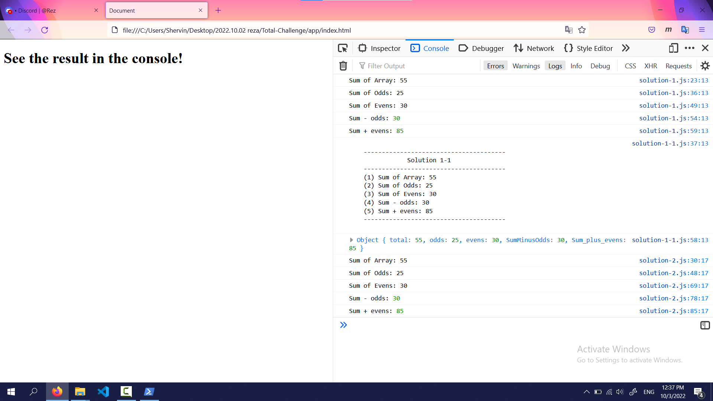

# Total Challenge
2022.10.03 | by khanim97@gmail.com

## Links

* [watch video](https://archive.org/download/total-challenge/total-challenge.mp4)
(if the link does not work try this link: [overview video](https://archive.org/details/total-challenge))

* [github repository](https://github.com/Junior-Front-End/Reza-King)

## How to execute all functions in one function?
* Solution 1: Simple function! 
* Solution 1-1: Combine All logs!
* Solution 2: Create a class!  

## Result

